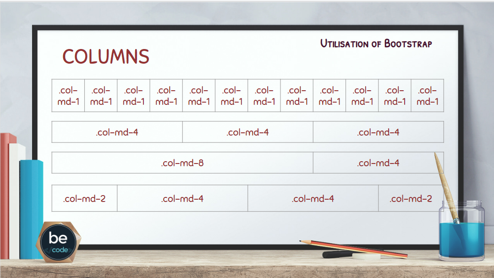

# exercises-bootstrap
## Why use bootstrap?
- **Easy to use**
- **Responsive features**
- **Mobile-first approach**
- **Browser compatibility**
## How to use Bootstrap?
To use Bootstrap on your own web site:
1) Download Bootstrap from getbootstrap.com
2) Include Bootstrap from a CDN
 ```  
<!-- Latest compiled and minified CSS -->
<link rel="stylesheet" href="https://maxcdn.bootstrapcdn.com/bootstrap/3.4.1/css/bootstrap.min.css">

<!-- jQuery library -->
<script src="https://ajax.googleapis.com/ajax/libs/jquery/3.6.0/jquery.min.js"></script>

<!-- Latest compiled JavaScript -->
<script src="https://maxcdn.bootstrapcdn.com/bootstrap/3.4.1/js/bootstrap.min.js"></script>
```
## Grid classes:
- xs (for phones - screens less than 768px wide)
- sm (for tablets - screens equal to or greater than 768px wide)
- md (for small laptops - screens equal to or greater than 992px wide)
- lg (for laptops and desktops - screens equal to or greater than 1200px wide)



